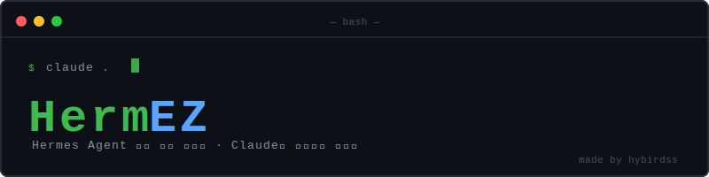
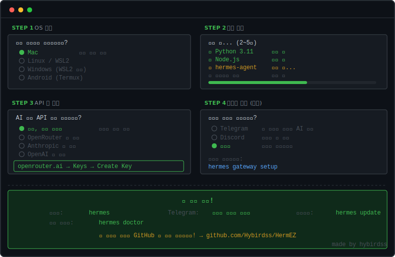

**Hermes Agent 한방 설치 마법사** — Claude/Codex가 처음부터 끝까지 해줍니다.

```bash
git clone https://github.com/Hybirdss/HermEZ && cd HermEZ && claude .
```

그게 전부입니다.

---

## 이렇게 진행됩니다



---

## 비슷한 레포

OpenClaw 설치 마법사도 있습니다 → **[OpenOpenclaw](https://github.com/Hybirdss/OpenOpenclaw)**

---

## 요구사항

- [Claude Code](https://claude.ai/code)
- 인터넷 연결

---

*Based on [NousResearch/hermes-agent](https://github.com/NousResearch/hermes-agent)*
